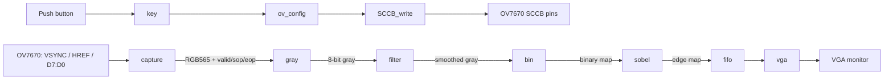

# Architecture

## Functional Overview

The design implements a streaming grayscale edge-detection pipeline for an OV7670 camera. Pixels flow through the processing stages under valid/start-of-frame/end-of-frame markers.

## Clocking

- The original top-level instantiates `pll.v`, a Quartus-generated `altpll` wrapper.
- `capture`, image processing, FIFO, and VGA are intended to run from the PLL output.
- The exact PLL output frequency should be confirmed by regenerating the IP for the target FPGA. The VGA timing module itself is written for the 800 × 525 timing envelope associated with 640 × 480 output.

## Pixel Format and Resolution

- Camera input: 8-bit OV7670 byte stream.
- `capture.v`: combines two bytes into one RGB565 pixel.
- Per line, the capture logic receives 1280 bytes, producing 640 pixels.
- The vertical counter is 480 lines.
- Display target: 640 × 480 pixels.

## Frame Markers

The processing modules pass three control signals beside pixel data:

| Signal | Meaning |
|---|---|
| `*_vld` | Pixel data is valid |
| `*_sop` | Start of frame / first pixel marker |
| `*_eop` | End of frame / final pixel marker |

## Vendor IP

`pll.v`, `shift_ram.v`, and `sobel_shift.v` are Intel/Altera generated wrappers. The latter two implement delay-line / line-buffer functions used by the 3 × 3 image filters.
